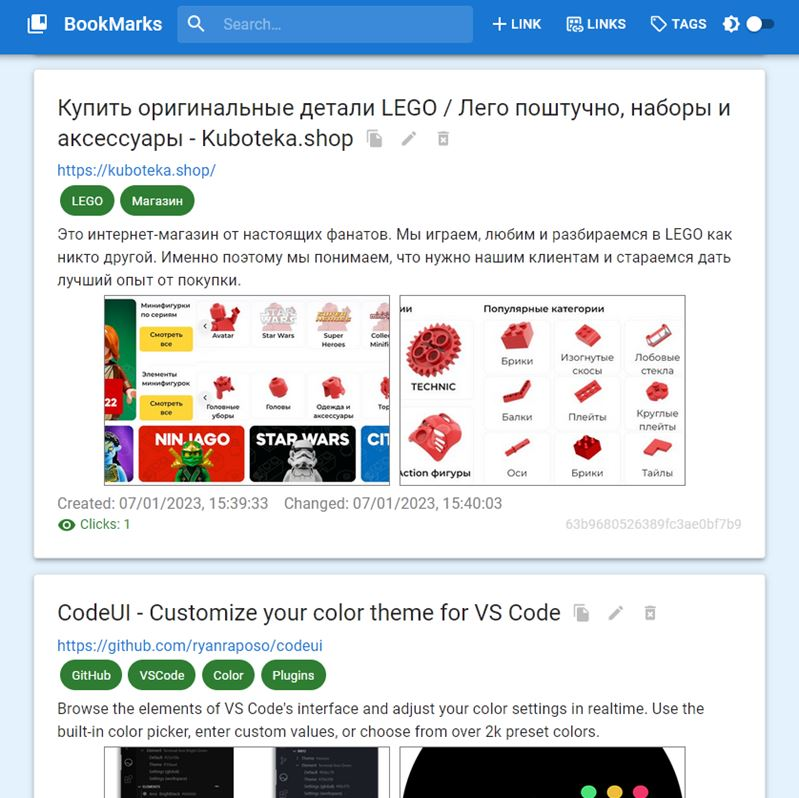
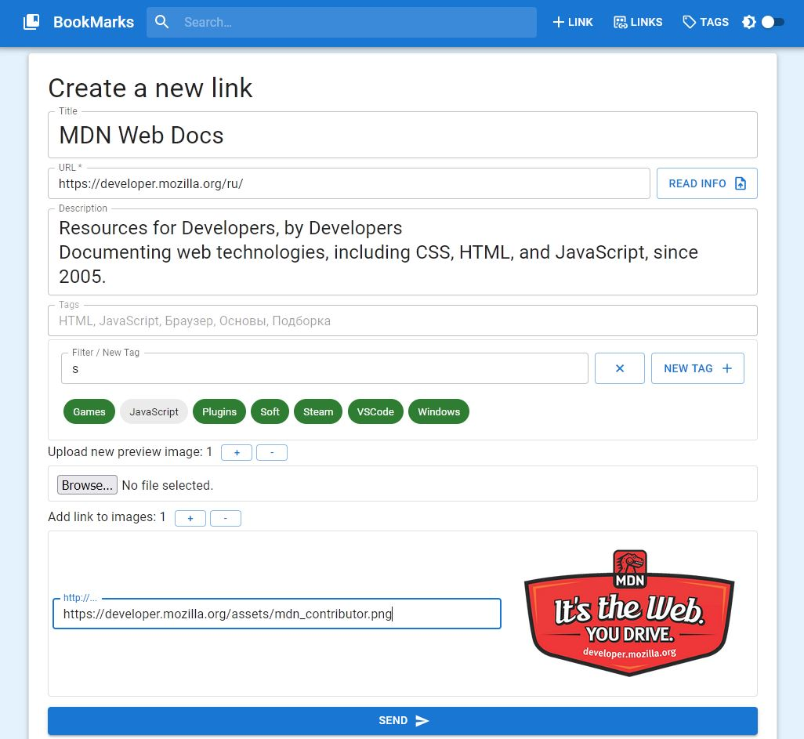
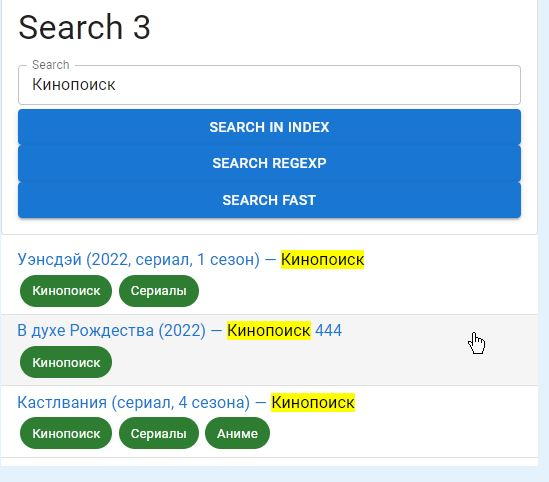
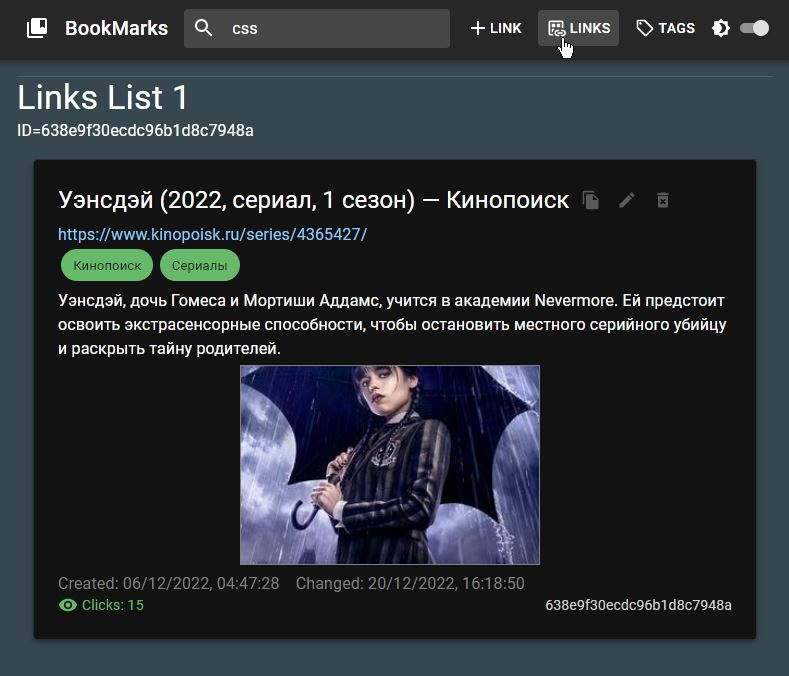

# BookMarks Storage SPA ❌ WIP

Персональный **self-hosted** сервис для хранения и организации ссылок на сайты в интернете. Есть поддержка тэгов, возможность добавлять изображения для предпросмотра. Данные хранятся на сервере MongoDB, доступ к ним осуществляется из браузера через сервер Express. Запускаю на локальном компьютере и использую для личных нужд.

### Использованные технологии:

**Сервер**:

- Node.js
- Express
- MongoDB
- Mongoose

**Клиент SPA**:

- React
- React Router
- Material UI

---

### Ознакомительные скриншоты

